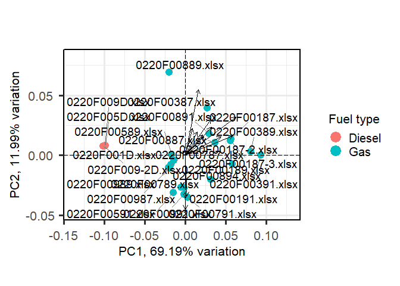
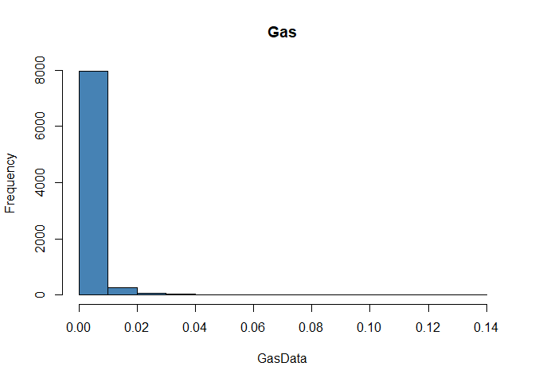
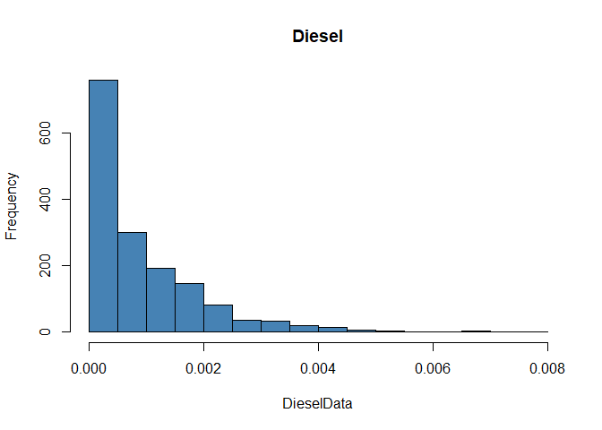
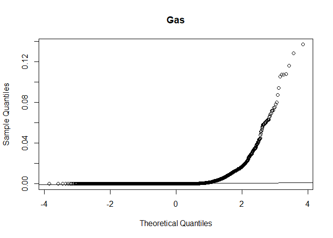
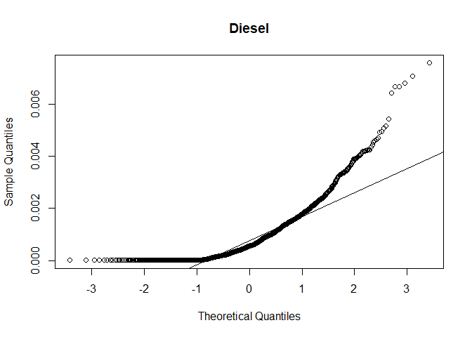
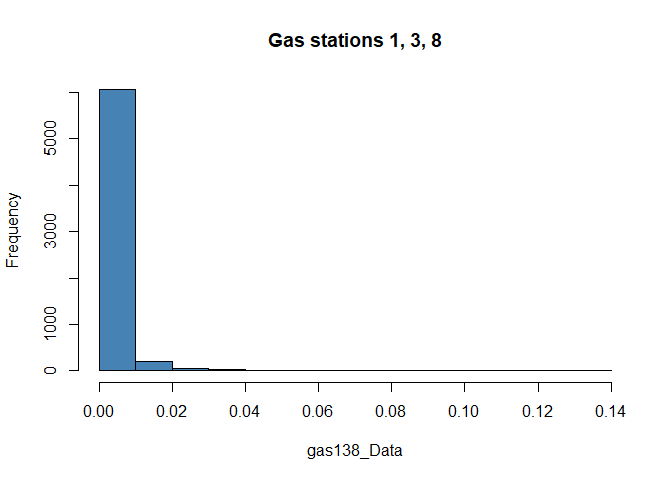
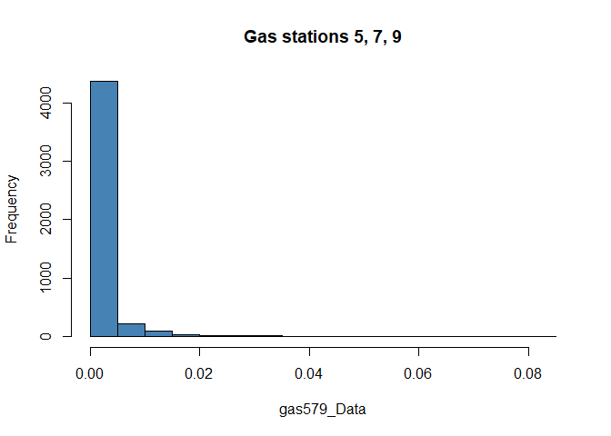
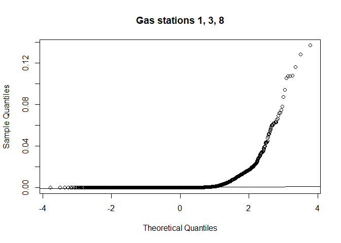
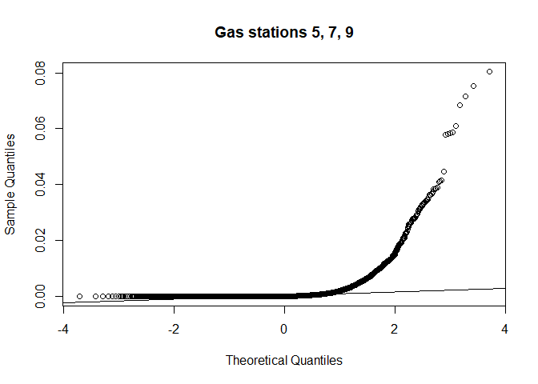

## Documentation

This repo is accompanying the publication: “The Use of Computational
Fingerprinting Techniques to Distinguish Sources of Accelerants Used in
Wildfire Arson”.

Users need to first install R with this
[link](https://cran.r-project.org/mirrors.html) and Rstudio with this
[link](https://posit.co/download/rstudio-desktop/).

This workflow ran on Windows 11 OS 11th Gen Intel(R) Core(TM) i7-11800H
@ 2.30GHz, 16 GB RAM;

THe RStudio version used in this demo is 2023.06.0+421 “Mountain
Hydrangea” Release for Windows;

The R version used in this demo is 4.3.1

## Data processing

First, the following R packages are installed and loaded in the global
environment along with in-house built functions to minimize
repetitiveness in the code.

Details about these functions can be found in Data processing.R file in
this repo.

``` r
# Loading Packages --------------------------------------------------------
library(ggplot2)
library(readxl)
library(tidyverse)
library(dplyr)
library(data.table)
library(Hmisc)
```

``` r
# Functions -------------------------------------------------------------------------------------------------------
filtering <- function(df, filter_list) {
  clean_data <-  copy(df)
  for (ele in filter_list) {
    clean_data <- clean_data %>%
      filter(!grepl(ele, Compound))
  }
  return(clean_data)
}

# Filtering limit of observations
limit_obser <- function(df_list, file_list, cap) {
  df_list_filter_area <- list()
  df_list_removed_area <- list()
  for (i in 1:length(df_list)) {
    df_list_filter_area[[i]] <- df_list[[i]] %>%
      filter(., Area > cap) %>%
      mutate(sample_name = file_list[[i]]) %>%
      # Grouping samples into fuel types
      mutate(fuel_type = ifelse(str_detect(sample_name, "DieselComp"), "DieselComp", 
                                ifelse(str_detect(sample_name, "GasComp"), "GasComp",
                                       ifelse(str_detect(sample_name, "D"), "Diesel", "Gas")))) %>%
      # Grouping samples into respective Gas stations
      mutate(gas_station = ifelse(str_detect(sample_name, "F009"), "Station_9", 
                                  ifelse(str_detect(sample_name, "F001"), "Station_1",
                                         ifelse(str_detect(sample_name, "F007"), "Station_7", 
                                                ifelse(str_detect(sample_name, "F005"), "Station_5", 
                                                       ifelse(str_detect(sample_name, "F003"), "Station_3", 
                                                              ifelse(str_detect(sample_name, "F008"), "Station_8", "Composite")))))))
    
    df_list_removed_area[[i]] <- df_list[[i]] %>%
      filter(., Area <= cap) %>%
      mutate(sample_name = file_list[[i]]) %>%
      # Grouping samples into fuel types
      mutate(fuel_type = ifelse(str_detect(sample_name, "DieselComp"), "DieselComp", 
                                ifelse(str_detect(sample_name, "GasComp"), "GasComp",
                                       ifelse(str_detect(sample_name, "D"), "Diesel", "Gas")))) %>%
      # Grouping samples into respective Gas stations
      mutate(gas_station = ifelse(str_detect(sample_name, "F009"), "Station_9", 
                                  ifelse(str_detect(sample_name, "F001"), "Station_1",
                                         ifelse(str_detect(sample_name, "F007"), "Station_7", 
                                                ifelse(str_detect(sample_name, "F005"), "Station_5", 
                                                       ifelse(str_detect(sample_name, "F003"), "Station_3", 
                                                              ifelse(str_detect(sample_name, "F008"), "Station_8", "Composite")))))))
  }
  return(list(df_list_filter_area, df_list_removed_area))
}

# Notin function
`%notin%` <- Negate(`%in%`)

# Grouping compounds based on RT1, RT2, and Ion1 - Version 1
grouping_comp_ver1 <- function(data, rt1thres, rt2thres, ion1thres, ion2thres) {
  
  # create empty list, each sub-list is a compound group with following criteria:
  # rt1thres: RT1 threshold window
  # rt2thres: RT2 threshold window
  # ion1thres: Ion1 threshold window
  # ion2thres: Ion2 threshold window
  # region_applied: list of x-y coordinate for different regions to applied different threshold window, x-axis is RT1, y-axis is RT2
  dat <- copy(data) %>% 
    arrange(RT1, RT2)
  
  # Initialize the compound column filled with NA values
  dat$collapsed_compound <- NA
  i <- 1
  
  for (row in 1:nrow(dat)) {
    # filter data by index, ALWAYS DO THIS INSTEAD OF CREATE SUBSET DATAFRAME
    rt1 <- dat[row,]$RT1
    rt2 <- dat[row,]$RT2
    ion1 <- dat[row,]$Ion1
    ion2 <- dat[row,]$Ion2
    
    idx_thres <- which(dat$RT1 <= (rt1 + rt1thres) & dat$RT1 >= (rt1 - rt1thres) & 
                         dat$RT2 <= (rt2 + rt2thres) & dat$RT2 >= (rt2 - rt2thres) & 
                         dat$Ion1 <= (ion1 + ion1thres) & dat$Ion1 >= (ion1 - ion1thres) & 
                         dat$Ion2 <= (ion2 + ion2thres) & dat$Ion2 >= (ion2 - ion2thres) &
                         is.na(dat$collapsed_compound))
    
    if (identical(idx_thres, integer(0))) {
      next
    }
    else {
      dat[idx_thres, "collapsed_compound"] <- paste0("Compound_", i, ".")
      i <- i + 1
    }  
  }
  
  return(dat)
}

# Filtering similar and unique compound
comp_filter_ver1 <- function(data, n) {
  all_similar_compounds_idx <- c()
  all_other_compounds_idx <- c()
  all_unique_compounds_idx <- c()
  
  for (comp_grp in unique(data$collapsed_compound)) {
    # filter data by indexing, ALWAYS DO THIS INSTEAD OF CREATE SUBSET DATAFRAME
    idx <- which(grepl(comp_grp, data$collapsed_compound, fixed = TRUE))
    
    if (length(unique(data[idx,]$sample_name)) > (n - 1)) {
      all_similar_compounds_idx <- c(all_similar_compounds_idx, idx)
    }
    else if (length(unique(data[idx,]$sample_name)) < 2) {
      all_unique_compounds_idx <- c(all_unique_compounds_idx, idx)
    }
    else {
      all_other_compounds_idx <- c(all_other_compounds_idx, idx)
    }
  }
  similar_compounds <- data[all_similar_compounds_idx,] 
  other_compounds <- data[all_other_compounds_idx,] 
  unique_compounds <- data[all_unique_compounds_idx,]
  
  return(list(similar_compounds, other_compounds, unique_compounds))
}
```

## PCA

### Gas versus Diesel

    ## [1] TRUE



### Between groups of gas stations

    ## [1] TRUE


## Multiple Wilcoxon tests with p-value correction for multiple testing

### Research Question 1: Gas versus Diesel

Before running multiple Wilcoxon tests, it is recommended to examine
whether criteria for univariate parametric test, such as t-test, are
violated. If yes, then it is safe to proceed using non-parametric
univariate test, such as Wilcoxon test.

First, equal variance and normally distributed between two populations,
here are Gas and Diesel using histogram, Q-Q plots. Here, both Gas and
Diesel populations are NOT normally distributed.

``` r
GasData <- as.vector(t(cat_5[,c(1:21)])) # 100149 data points
DieselData <- as.vector(t(cat_5[,c(22:25)])) # 19076 data point

# Histogram
hist(GasData, col='steelblue', main='Gas')
```



``` r
hist(DieselData, col='steelblue', main='Diesel')
```



``` r
# Q-Q plots aka. Normal Probability plots
stats::qqnorm(GasData, main='Gas')
stats::qqline(GasData)
```



``` r
stats::qqnorm(DieselData, main='Diesel')
stats::qqline(DieselData)
```



Then, equality of variance between Gas and Diesel populations can be
examined using Levene’s test and Fligner-Killeen test for non-normally
distributed data. Here, for both tests, p values are \< 0.05, and thus,
there is significant difference in variances between Gas and Diesel
populations.

    ## Levene's Test for Homogeneity of Variance (center = median)
    ##         Df F value    Pr(>F)    
    ## group    1  34.244 5.016e-09 ***
    ##       9948                      
    ## ---
    ## Signif. codes:  0 '***' 0.001 '**' 0.01 '*' 0.05 '.' 0.1 ' ' 1

    ## 
    ##  Fligner-Killeen test of homogeneity of variances
    ## 
    ## data:  data by group
    ## Fligner-Killeen:med chi-squared = 531.7, df = 1, p-value < 2.2e-16

Here, multiple Wilcoxon tests followed by p-value correction for
multiple testing was done. Different method for p-value correction from
function *p.adjust* from package **stats** were used. After p-value
correction, the threshold for p-value can be set (for example,p.adjust
\< 0.05 or \< 0.1), to see how it affects the number of significant
compounds that can be found. Importantly, the threshold should be set so
that it can include as many ASTM reference compounds in the list of
significant compounds as possible. For example here, no significant
compounds can be found with adjusted p-value \< 0.05. But when adjusted
p-value is \< 0.1, 127 significant compounds are found.

    ## [1] "Number of significant compounds with adjusted p-value < 0.05 = 0"

    ## [1] "Number of significant compounds adjusted p-value < 0.1 = 127"

### Research Question 2: Distinguishing samples from groups of gas stations

Here again, before running multiple Wilcoxon tests, it is recommended to
examine whether criteria for univariate parametric test, such as t-test,
are violated. If yes, then it is safe to proceed using non-parametric
univariate test, such as Wilcoxon test.

First, equal variance and normally distributed between two populations,
here are Gas and Diesel using histogram, Q-Q plots. Here, both Gas
station group 1 (1, 3, 8) and Gas station group 2 (5, 7, 9) populations
are NOT normally distributed.

Equality of variance between Gas station group 1 (1, 3, 8) and Gas
station group 2 (5, 7, 9) populations can be examined using Levene’s
test and Fligner-Killeen test for non-normally distributed data. Here,
for both tests, p values are \< 0.05, and thus, there is significant
difference in variances between Gas station group 1 (1, 3, 8) and Gas
station group 2 (5, 7, 9) populations.



    ## Levene's Test for Homogeneity of Variance (center = median)
    ##          Df F value Pr(>F)
    ## group     1  0.6128 0.4338
    ##       11149

    ## 
    ##  Fligner-Killeen test of homogeneity of variances
    ## 
    ## data:  data by group
    ## Fligner-Killeen:med chi-squared = 713.21, df = 1, p-value < 2.2e-16

Here, multiple Wilcoxon tests followed by p-value correction for
multiple testing was done. Different method for p-value correction from
function *p.adjust* from package **stats** were used. After p-value
correction, the threshold for p-value can be set (for example,p.adjust
\< 0.05 or \< 0.1), to see how it affects the number of significant
compounds that can be found. Importantly, the threshold should be set so
that it can include as many ASTM reference compounds in the list of
significant compounds as possible. For example here, no significant
compounds can be found with adjusted p-value \< 0.05. But when adjusted
p-value is \< 0.1, 127 significant compounds are found.

    ## [1] "Number of significant compounds with adjusted p-value < 0.05 = 75"

    ## [1] "Number of significant compounds adjusted p-value < 0.1 = 94"
